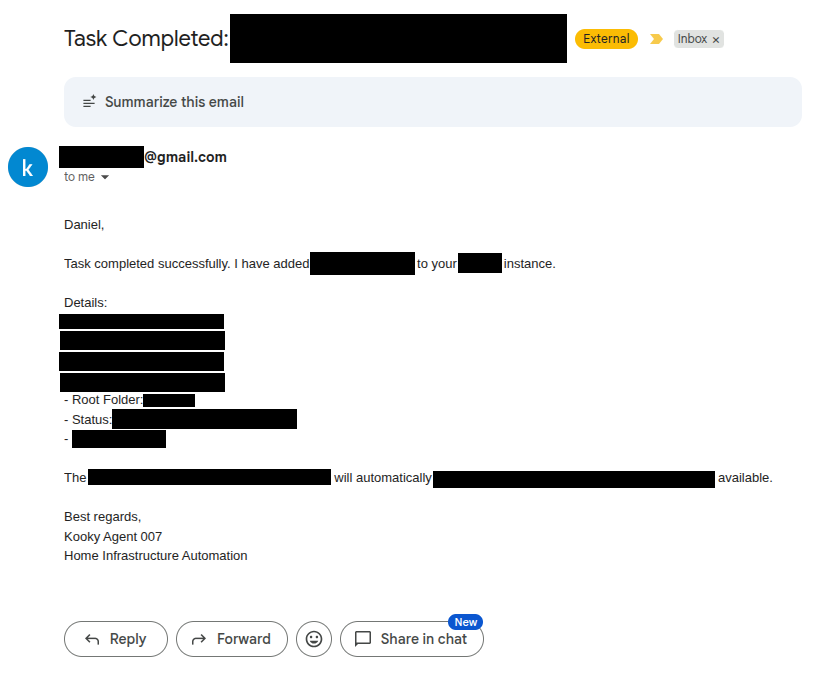

# An Agent for Home

Over this last weekend, I came across a hackernews post talking about Moltbook and another about OpenClaw. I hadn't really ever messed with fully automated agents, just Cursor for work.

I got caught up in the initial headlines everyone else did, agents talking to each other seemingly about what is a soul. Real TNG's "The Measure of a Man" type stuff. But I started thinking about how maybe setting up an agent could help me with things around the virtual house.

Like a lot of other tech nerds, I have various servers at home of different shapes and sizes, running all sorts of applications that I manage. I have a TrueNas Mini that serves as my main media server. It runs my arr stack, serves video via plex, and music via Navidrome. With all the fun things in between.

I also have a variety of different flavored pis, from Raspberry to Orange, also a few LePotatos. I can count 7 SBCs in the room I'm typing this, all running their various applications and tasks. One is my Octoprint server hooked up to my 3d printer, another is just sitting waiting for me to figure out what to do with it.

All the services accessible via an nginx reverse proxy sitting on another little pi in my closet.

Everything runs smoothly, I don't have to manage things anymore. I used to have to update my SSL Certificate once a year, but since automating using certbot directly in a docker container alongside my nginx reverse proxy, everything is pretty much set it and forget it. But there are rare occasions where I may need to intervene to fix an issue. Really the one thing that has been coming up once every month or so is a failed import in Sonarr. Usually this is due to a bad file that was downloaded that I'll need to manually delete, then re-do the search. This is where the agent thinking came in. What if I just build an agent to monitor and fix any issues that come up?

So I connected to one of my servers warming up the bottom of my shirts in my clothing closet. A Beelink I bought off Ebay with a Ryzen 5 5560U. It was previously hosting a Palworld server my wife and I were playing in about a year ago. I asked her if it was okay if we took a backup and brought the Palworld server down for a bit. She agreed, so we were off to the races.

I had previously gotten Ollama working with a lightweight gemma-3 model on one of my raspberry pi 5s, using LibreChat as a frontend. It surprisingly worked and did okay, but as expected the response was a bit sluggish. This is when I decided to do a small upgrade to the Beelink. Chats were a bit faster, and I was able to successfully run some slightly heavier models, like gpt-oss-20b, but again pretty sluggish. (Btw all models I've used were unsloth gguf's from huggingface). At this point I was considering turning my 9800x3d with the 4090 gaming computer into an AI machine. But then I saw opencode provides some free models to use. That's pretty sweet. Free models it is and down the rabbit hole we go.

When I started with agents, I first checked out OpenClaw as it was the rage of the weekend. To tell the truth I could never get it to properly work with my locally running model. So I did what we in the industry call "pivoted" and tried out opencode.ai. I was able to get this to actually make the calls to my locally running models, but it was just really too slow. So time to try those free models out. Surprisingly they are pretty good, I've mostly been using Big Pickle. The agent was able to debug my 3d printer webcam issue and get it working properly with the reverse proxy. I mean I probably could have done it myself in a fraction of the time, but it was cool to see the agent do it after working over the weekend nights after the kiddo is asleep to get it up and running.

I'll probably post a few more times on this topic. One thing I find interesting is the whole idea of an evolving SOUL.md. Allowing the agent to write to the SOUL.md with every session, and have that SOUL.md loaded with every susequent session. Do you just let them go on to write some crazy huge markdown file that evolves into some sort of "personality". I had been dabbing quite a bit while I was doing this project over the weekend, so it was fun topic to think about while stony. 
In any case "Kooky Agent 007" has its own gmail account now and helped me push this blog post out.

It's weird when I wrote out that last sentence, I originally wrote "has his own gmail account".

## Mail time

Time to extend the workflow to outside of the agent TUI.
I wanted my agent to start becoming a little more autonomous. Setting up the daemon was a good start, but actually getting it to do things without me sending commands in the terminal is really the next step in all of this. Probably setting up some sort of queue in Redis and having it listen to events is probably the correct way to do things, but that doesn't really feel "human" enough for me. The whole idea behind agents was to have it interact with outside services and such on your behalf, like a human. 
Any shmuck can use Redis, but my agent deserves better. 

It deserves a gmail account.

Now obviously I can't just have any ol' Dick or Harry send my agent an email and obliterate my home server. I needed to add some safeguards, and not just some instructions in a .md file someone could tell the agent to ignore. I decided the best way to do this would be an email inbox checker SKILL.md + Gmail labels. 

Normally in a business google workspace account, you can set up a blacklist to just delete emails that don't come from a specific person. But I was too cheap to spend the extra money on creating a user for this agent. So after setting up it's free gmail account, I created a filter in Gmail that applied the tag "Allowed" to any email that was received from my personal daniel.ryan@310networks.com email address. After adding the specific instructions to search only for that label in the SKILL.md, I set up an hourly cronjob to ask the agent to check it's inbox for any new tasks and complete them accordingly.

I ran some test emails trying to get the agent to run a command from an email other than the ones marked allowed. Each time the email was properly left unread, while the emails labeled "Allowed" were properly processed. So far so good. 

Much like the Epstein files, here is a heavily redacted image of an email:

I have some friends and family that use some of the services I self-host.
The idea behind this was to give them [REDACTED]. I could add a select few users to the "Allowed" list to have them interact with the agent directly. Allowing them to [REDACTED] without needing to reach out to me to [REDACTED] for them.
