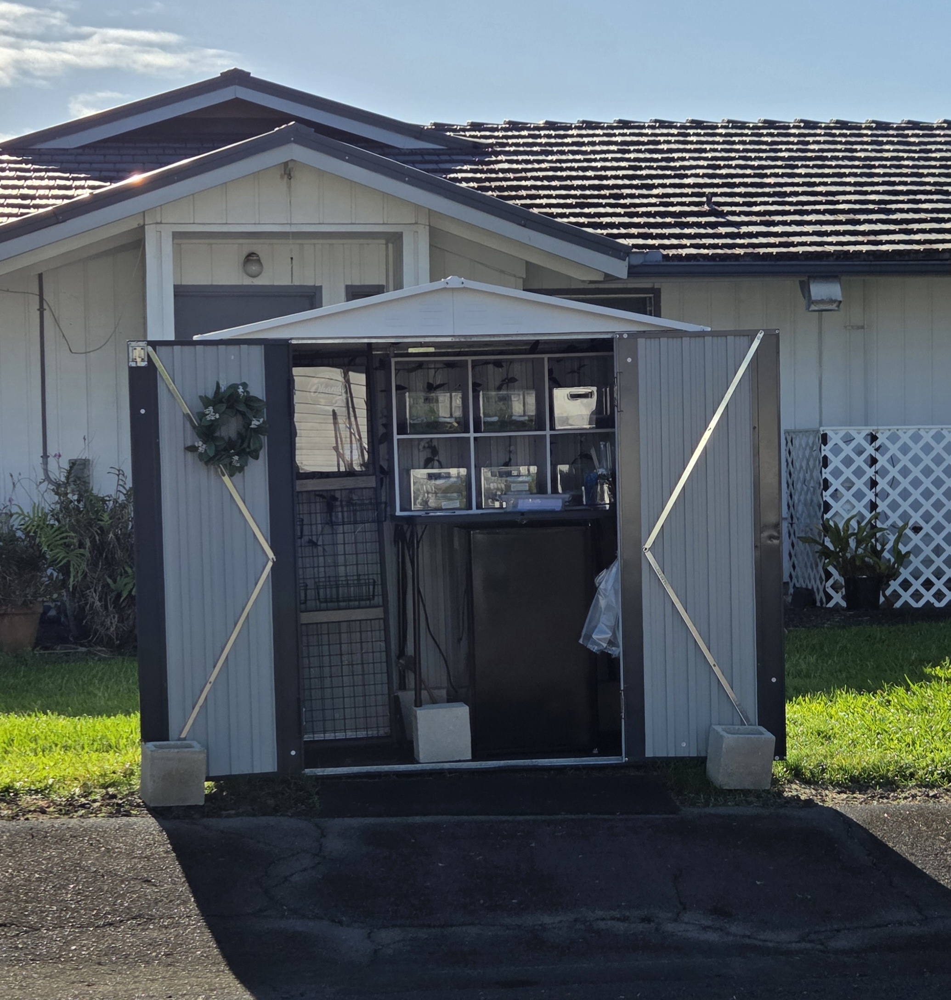
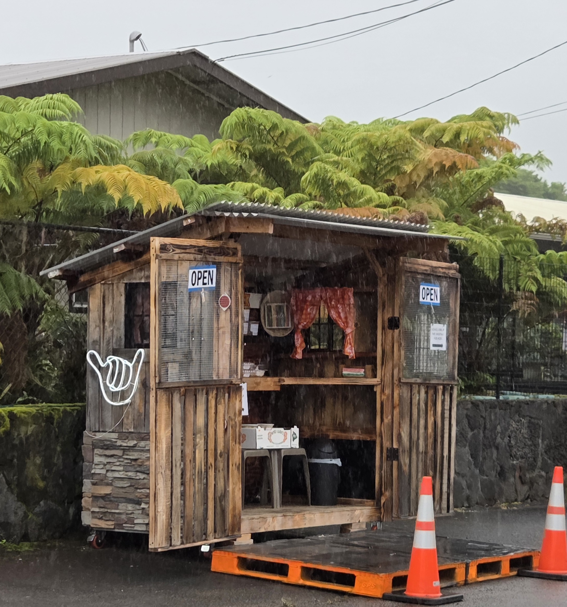
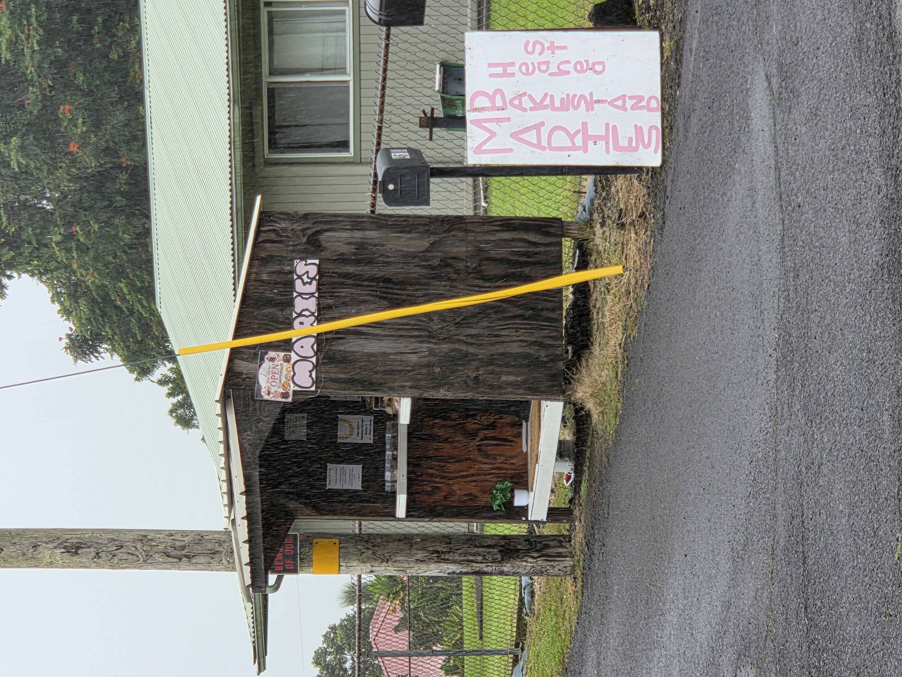

A little wooden shed with an "OPEN" flag waving greets you as you pull your car over onto the gravel and grass. Personal apple pies, cookies, brownies, all freshly baked. There are even some full hot meals.

We've been living on the Big Island of Hawaii for a little over 4 years now. The eastern side of the Island gets a ton of rain, the most among any state in the US. From downpours to sunny skies with drizzling rain, we get it all. This makes for awesome vegetation, along with all the tropical fruits the island is known for. So seeing fruit and vegetable stands outside people's homes is pretty common. The "lettuce lady" down the street from me has really good leafy green lettuce, and it's cheaper than the town's Safeway grocery store. Hilo and Puna have great farmers' markets as well.

But recently a new type of stand has been popping up: the Bake Stand.

9 Acres Farmstand is a bake stand in my neighborhood that is owned and run by a lady who is originally from the southern part of the US. She has some great shrimp po' boys and beignets. The prices are typically very reasonable, cheaper than going to a bakery or restaurant.

One of the things I enjoy most about living on the Big Island is its pace, affectionately known as "island time." People, for the most part, go through life a little more deliberately, more slowly, intuitively. Pulling over and talking to walking neighbors, giving rides to disabled hitchhikers, or setting up unsupervised stands with freshly made treats and a QR code for Venmo or a cash lock box. I'm not totally sure you could be as trusting in larger metropolitan cities.

Though it would be nice to see this trend start to spread.

*This blog post was handwritten in ink, then transcribed by AI*

