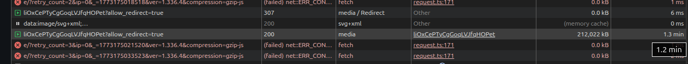
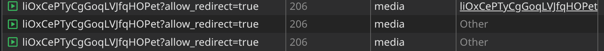

# Moving from Discord to a self hosted Matrix server

## Discord shooting themselves in the foot got the ball rolling
Over the last few weeks I have been working on a self hosted Matrix server to replace Discord. For a long time I have been critical of Discord's business practices, like them saving a history of every message you send and using it however they see fit, _see [Discord's Privacy Policy](https://discord.com/privacy)_ for more information. Discord has said "This is powered in part by our internal safety systems, which can already make an age determination for many adult users without any user action." [Discord's global age assurance statement can be read here](https://discord.com/blog/getting-global-age-assurance-right-what-we-got-wrong-and-whats-changing). 

Things started to get really spicy when people learned Discord was working with Persona, a Peter Thiel backed identification tracking software. Turns out people don't like when companies work with the anti-christ. They backtracked on the partnership, but the news was hot and more people were starting to get behind the idea of looking for something else. 
I had been wanting to get off of Discord for years, but now I actually had some friends seriously considering it as well...

Time to strike while the iron is hot!

## Getting something up and running
I started looking at all the usual suspects: Matrix, Slack, IRC, and Stoat. Basically it came down to what the development ecosystem was like, functionality, and self hosting abilities.
I ended up on Matrix, and decided to deploy using Element's [Matrix Synapse](https://github.com/element-hq/synapse)

I was able to get a server up and running with Video and Voice calls working. I've got everything running in docker containers and sitting behind the same nginx reverse-proxy that my other services sit behind (more on this later). I'm not going to go through the entire setup in detail here, but feel free to check out the [github repo](https://github.com/Kookster310/local-matrix-stack/). 

There were some interesting hurdles I came across throughout this process, along with some really funny developments that actually affect my entire self hosted stack. I thought they were worth sharing.

## The hurdles

### Video + Voice calls
The first thing to get working was Video and Voice calls. I started off with Jitsi as I had actually heard of it, but it doesn't integrate very well. It creates an external room outside of the Element application, which is not what I was looking for.

So on to Livekit. The good folks at Element-HQ have created a [lk-jwt-service](https://github.com/element-hq/lk-jwt-service) that "bridges Matrix and LiveKit, handling authentication and room creation when needed". 

Honestly not much else to say here. It took a little trial an error, but once I got it configured properly, had the proper ports forwarded, and DNS records created, calls started working.

### Watching large videos. The 200 vs 206 range request fiasco
As the instance is starting to get regular chatter, another issue pokes its head out. Watching large videos in a text channel wasn't working, or so I thought. I had pressed play and nothing was happening. I started looking through my configs and logs, when all of the sudden a couple minutes later I hear the bass thump of electronic dance music. The sample video I was testing had finally started playing.

One nice thing about the Element desktop application is you can enable developer tools in the app. So I pop it open and press play, that's when I see the that Element is downloading the entire video prior to it starting.


I noticed it was responding with a 200 rather than doing the request in ranges with a 206. So I set up my reverse proxy vhost to allow for 206 calls to the media store, only to find out that [synapse doesn't support 206 range requests](https://github.com/element-hq/synapse/issues/4780). 

zzzz...

So time to come up with a workaround. I decided to have nginx serve the files directly from the file system, bypassing synapse. However I still needed to authenticate bearer tokens and ensure the files are not publicly accessible. The snippet below is what I came up with:

```
    # Internal auth subrequest — validates bearer token against Synapse
    location = /_auth {
        internal;
        proxy_pass http://matrix-synapse:8008/_matrix/client/v3/account/whoami;
        proxy_pass_request_body off;
        proxy_set_header Content-Length "";
        proxy_set_header X-Forwarded-For $remote_addr;
        proxy_set_header X-Forwarded-Proto $scheme;
        proxy_set_header Host $host;
        proxy_set_header Authorization $http_authorization;
    }

    # Internal location for direct file serving — not accessible externally
    location /media_store/ {
        internal;
        alias /media_store/;
        add_header Accept-Ranges bytes;
    }

    # Authenticated local media download — validate token then serve from disk
    location ~ ^/_matrix/client/v1/media/download/url\.ishidden\.com/(..)(..)(.+)$ {
        auth_request /_auth;
        alias /media_store/local_content/$1/$2/$3;
        add_header Accept-Ranges bytes;
        add_header Access-Control-Allow-Origin *;
    }
```



Voila! Video playback begins as soon as you click play and downloads as you watch accordingly. I did notice some buffering happening on higher bitrate videos though... Upload and download speeds were also quite slow. Which brings me to the next issue I found. An infrastructure issue.

### Upload + Download speeds: the hilarious bottleneck in my self hosted architecture
I started looking into where the slowness was coming from. I ran some curl tests that would download the video and record the transfer rate. I tested locally on the synapse server itself and as to be expected, the download rate was stupid fast. Then I tested from the reverse proxy over the internal network, and oh my was I in for a surprise... Speeds of 20-40 Mbps? Wtf?

I started poking around on the reverse proxy and what I found made me laugh out loud.
```
kookster@reverse-proxy:~$ ifconfig |grep -B1 10.10
wlx3c3300600c1d: flags=4163<UP,BROADCAST,RUNNING,MULTICAST>  mtu 1500
        inet 10.10.42.231  netmask 255.255.255.0  broadcast 10.10.42.255

kookster@reverse-proxy:~$ nmcli device status|grep wlx3c3300600c1d
wlx3c3300600c1d  wifi      connected               310-Networks
```

The main reverse proxy I use to route inbound traffic to all of my self hosted services was using a cheap wireless dongle... 

As my buddy so eloquently put it after telling him: "LOL"

To be honest, I'm quite surprised things have worked as well as they have.

The irony of moving over to self hosted solutions in the name of privacy, all the while using some cheap chinese networking dongle is not lost on me. The whole thing was really quite hilarious.

Anyway I go and plug my reverse proxy into my network with an ethernet cable, move all my local DNS records over to the new internal IP, update a few configs, and we are back in business. Suddenly I'm getting 95 Mbps between the reverse proxy and the synapse server. Not the 1Gbps I thought the tiny little SBC could handle, but whatever. Videos weren't buffering anymore and uploading them was much faster. I'll probably upgrade the reverse proxy to something with a gigabit NIC at some point, but I just don't care enough right now.

One other issue worth mentioning is the reverse proxy was not using my networks Pihole for DNS resolution. It was using the router and was loading the public IP addresses for all my internal services, creating a hairpin NAT issue. Pointing the reverse proxy to the proper DNS server resolved that issue and increased speeds as well. All this testing had revealed some real issues in my network, and I'm glad they were uncovered.

### Getting people to use it
This is ***by far*** the hardest part of the entire migration. You can have the best alternative in the world, but if people don't use it, then it doesn't matter. You're just a lonely nerd sitting in your self hosted chat room by yourself, or worst yet with an AI chatbot. Getting people to download [Element](https://element.io) to their desktops and/or mobile phones and actually getting them to open it up and use it instead of Discord was tough.

Devops is easy. I can debug issues, work with Claude or something, and figure that out. 

Convincing a human to do something is freaking hard.

So how did I get people to actually do it? I didn't, my brother did. All it takes is one other person to jump in, and the rest started following.

I enjoy playing video games from time to time, and the one I typically play while in voice chat is Path of Exile. You don't actually play with other people in POE, you can, but you don't. You just hang out in the same voice channel, talk about the content your running, what your build is looking like, etc. They release new content in the form of a "new league" every few months. So about every 3-4 months, I hop in Discord and catch up with my fellow exiles.

Leading up to league start day, we'll be chatting in Discord about what build we want to play, what changes were brought into the game, stuff like that. But then my brother posted something in our gaming Discord channel: 

_"I’ll be on Element for league start tho!"_

My man!

League start rolls around, and my brother and I hop in the newly created Path of Exile video room (with webcams disabled, duh), and start playing. Sure enough my other brother (there's only 3 of us, no more to show up) reluctantly downloads Element. Then a few other friends begrudgingly download Element and hop in. Next thing you know we have our core group all in a voice call in Element, playing POE. Without the Discord boogeyman peaking over our shoulders.

## So... how are things going?
Eh, it's okay. I'm not going to sit here and tell you it's just as good as Discord. It's not. That would be a lie.  I'm (and hopefully my friends and others are) willing to deal with a few shortcomings in order to keep our private conversations private. There are definitely some things that can be done to improve the user experience though. 

### Where Element and/or Matrix needs to improve

**Custom Emoji Packs**

This one seems like it's going to be one of the most requested, though I don't honestly know if it will ever be a thing. It looks like there was a spec proposal [github issue](https://github.com/matrix-org/matrix-spec-proposals/issues/1256) that was created in May 2018. It was then moved to [another issue](https://github.com/matrix-org/matrix-spec-proposals/pull/1951) which was then obsoleted for [another issue](https://github.com/matrix-org/matrix-spec-proposals/pull/2545) which is now an open PR. It looks like there is still some progress, but the fact this has been going on for almost 8 years now is a little worrisome.

There were some other Matrix clients I had come across like FluffyChat that had some crude implementations for custom emojis. But they seemed to fall short in other areas. Hopefully this spec proposal gets figured out and we can see some movement with custom emojis.
 
**Call participant preview**

I like to know what I'm getting myself into, and this includes voice calls with friends. There's an open [github issue](https://github.com/element-hq/element-meta/issues/3121) for this one as well.

**GIF autoload on URL**

If I paste a URL to a .gif, I'd like it to auto load the gif in the channel. There are some workaround where you can have a bot monitoring .gif and then downloading + uploading it to channel, but that is clunky af. 
The current solution isn't too bad though, you just need to click and drag the gif over from your browser to Element, and it will auto-upload it. Still, would be nice to have.

### Where Element and Matrix wins over Discord
**Upload size restrictions**

No need to pay a monthly subscription fee to increase your upload size to your server. Just make a few changes to your homeserver.yml and nginx vhost and you're good to go. I set mine at 2GB, that seems large enough.

**Privacy and E2EE**

This is obviously the most important advantage to this setup. It is nice having a conversation with friends that is not being eavesdropped on.

## Will it survive?
Honestly...? I don't know. Matrix.org isn't Apache or some other massive OSS that pulls in a bunch of donation money. If the few issues I mentioned before are addressed, then things would be in a great state. 

I do hope it keeps pushing on and remains a viable option, as I really don't want to go back to Discord.
